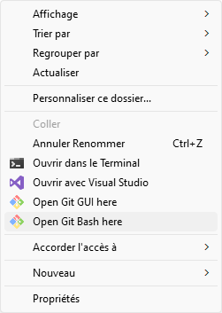
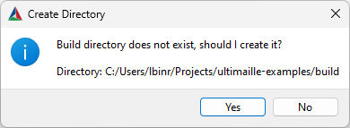
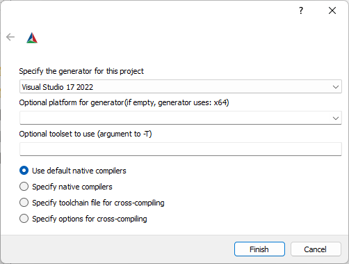
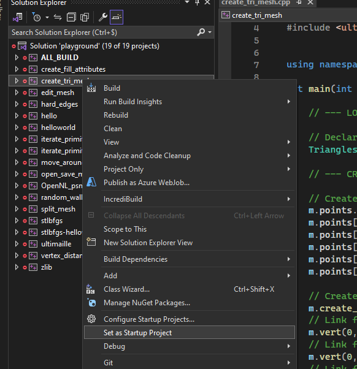

---
    hide:
        - navigation
---

# Windows

## 1. Prerequisite

Depending on your OS, you will need to download and install a few tools.

 - [CMake](https://cmake.org/download/){:target="_blank"}
 - [Git](https://git-scm.com/){:target="_blank"}
 - [Visual Studio C++](https://visualstudio.microsoft.com/fr/vs/features/cplusplus/){:target="_blank"}

## 2. Get examples

To get started, you should clone the Ultimaille examples. Right-click in the folder where you wish to clone the repository, select `Open Git Bash here`. 

Then type the following command (trick: copy as usual by __Ctrl^c__, but click middle button to paste in the git bash windows): 

`git clone https://github.com/ultimaille/ultimaille-examples.git`

## 3. Build and run examples

 - Open CMake GUI and configure like this:

    - "where is the source code": set the folder where you have cloned ultimaille-example + "/ultimaille-example"
    - "where to build the binaries": set the folder where you have cloned ultimaille-example + "/ultimaille-example/build"

!!!warning
    Using these folders is required for the examples to find their assets.

 - Click __Configure__
 - CMake will asks you to create the build folder, click on __Yes__

 - CMake will asks you to specify generator, just click __Finish__

 - Next, in CMake main interface, click on __Generate__, __Open Project__

 - In the VS C++ solution explorer, right click on project `create_tri_mesh` and select __Set as Startup Project__

 - Run `create_tri_mesh.exe` in VS with __Ctrl+F5__

That's it, you should see a simple triangular surface displayed in the Graphite viewer.

## What does the example do ?

### Git / CMake

 - Git clone is used to copy ultimaille-examples in your local computer
 - CMake configure the environment, it downloads Ultimaille library, Graphite viewer and put them at the right place in the `build` directory
 - CMake then generate Visual Studio solution and projects, which will then be used for compilation

### Code

 - The code use Ultimaille library to create a triangle surface composed by 5 points and 3 facets (3 triangles) and write the mesh in a file named `tri_mesh.geogram`
 - Then, system is called to execute Graphite viewer - which was previously automatically downloaded and unzip by CMake in the `build` directory of `ultimaille-examples` - and open the generated mesh.

!!!note 
    You can find an in-depth description of the examples in the How to section.

## What's next

Edit `create_tri_mesh.cpp` using [How to ?](../how_to/index.md) pages to experiment other features.