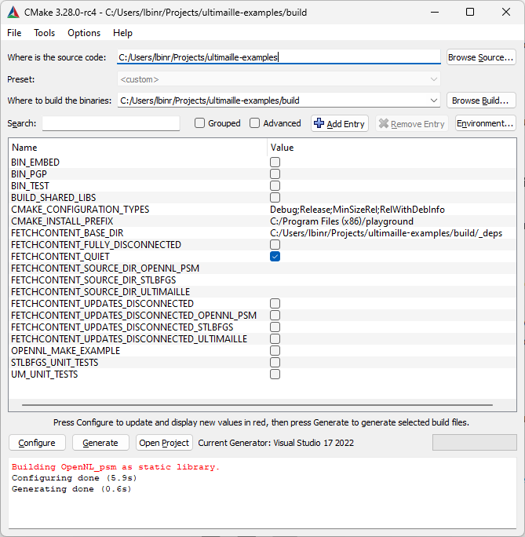

---
    hide:
        - navigation
---

# Getting started

## 1. Prerequisite

Depending on your OS, you will need to download and install a few tools.

| Windows | Linux |
| --- | --- |
| <ul><li>[CMake](https://cmake.org/download/)</li><li>[Git](https://git-scm.com/)</li><li>[Visual Studio C++](https://visualstudio.microsoft.com/fr/vs/features/cplusplus/)</li><li>[Graphite](https://github.com/BrunoLevy/GraphiteThree/releases)</li></ul> | <ul><li>[CMake](https://cmake.org/download/)</li><li>[Git](https://git-scm.com/)</li><li>Any IDE, for example [VS Code](https://code.visualstudio.com/)</li><li>[Graphite](https://github.com/BrunoLevy/GraphiteThree)</li></ul> |

## 2. Get examples

To get started, you should clone the Ultimaille examples [ultimaille-example](https://github.com/ultimaille/ultimaille-examples){:target="_blank"}. Open a console and type the following command:

`git clone https://github.com/ultimaille/ultimaille-examples.git`

!!!note 
    You can find an in-depth description of the examples in the How to section.

## 3. Build and run examples

[Build and run for Windows](getstarted.md#windows) | [Build and run for Linux](getstarted.md#linux)

## Windows

 - Open CMake GUI and configure like this:

 - Click __Configure__, __Generate__, __Open Project__
 - In the VS C++ solution explorer, right click on project `create_tri_mesh` and click __Regenerate__
 - Run the generated `create_tri_mesh.exe` executable, it should generate a file named `tri_mesh.geogram`
 - Run Graphite `ultimaille-examples\build\GraphiteThree\bin\win64\graphite.exe`
 - Drag & Drop `tri_mesh.geogram` into Graphite to see the result

That's it, you should see a simple triangular surface displayed in the Graphite viewer. Now, you can try several examples or [create a project from scratch](getstarted.md#create-a-project-from-scratch).

## Linux

In the `ultimaille-examples` directory type the following command:

`cmake -B build && cd build && make -j && examples/create_tri_mesh && graphite tri_mesh.geogram`

This command will: 

 - generate MakeFiles for your platform
 - build the `ultimaille-examples`
 - run example `create_tri_mesh`
 - open the result in graphite (don't forget to add graphite to your PATH)

That's it, you should see a simple triangular surface displayed in the Graphite viewer. Now, you can try several examples or [create a project from scratch](getstarted.md#create-a-project-from-scratch).
___

## Create a project from scratch

If you wish to create a project from scratch that use ultimaille, copy, clone or fork [ultimaille-hello](https://github.com/ultimaille/ultimaille-hello){:target="_blank"} blank project. Next, we suggest you visit the [How To page](how_to/index.md).

## Note on Graphite viewer

A mesh can be visualized in a number of tools, such as meshlab. For our part, we use [Graphite](https://github.com/BrunoLevy/GraphiteThree){:target="_blank"}, a lightweight yet powerful viewer that can display meshes in a variety of formats, including the geogram format.

The geogram format is interesting because it allows you to handle different types of surface or volumetric meshes and associate data with them, which we call attributes. Graphite is able to display attributes in a pleasant way.

We recommend you to download and install graphite by following the instructions on [Graphite repository](https://github.com/BrunoLevy/GraphiteThree){:target="_blank"}.

For our part, we will use graphite throughout this tutorial to visualize our results. Below an overview of Graphite:

____
Next: [How to ?](how_to/index.md)