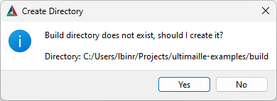
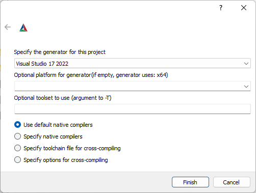

---
    hide:
        - navigation
---

# Getting started

## 1. Prerequisite

Depending on your OS, you will need to download and install a few tools.

| Windows | Linux |
| --- | --- |
| <ul><li>[CMake](https://cmake.org/download/){:target="_blank"}</li><li>[Git](https://git-scm.com/){:target="_blank"}</li><li>[Visual Studio C++](https://visualstudio.microsoft.com/fr/vs/features/cplusplus/){:target="_blank"}</li></ul> | <ul><li>[CMake](https://cmake.org/download/){:target="_blank"}</li><li>[Git](https://git-scm.com/){:target="_blank"}</li><li>Any IDE, for example [VS Code](https://code.visualstudio.com/){:target="_blank"}</li></ul> |

## 2. Get examples

To get started, you should clone the Ultimaille examples [ultimaille-example](https://github.com/ultimaille/ultimaille-examples){:target="_blank"}. 

### Windows

On Windows, right-click in the folder where you wish to clone the repository, select `Open Git Bash here`. 

Then type the following command: 

`git clone https://github.com/ultimaille/ultimaille-examples.git`

### Linux

Open a terminal and type the following command:
`git clone https://github.com/ultimaille/ultimaille-examples.git`

## 3. Build and run examples

### Windows

 - Open CMake GUI and configure like this:

 - Click __Configure__, __Generate__, __Open Project__
 - CMake will asks you to create the build folder, click on __Yes__

 - CMake will asks you to specify generator, just click __Finish__

 - In the VS C++ solution explorer, right click on project `create_tri_mesh` and select __Set as Startup Project__

 - Run `create_tri_mesh.exe` in VS with __Ctrl+F5__

That's it, you should see a simple triangular surface displayed in the Graphite viewer.

### Linux

In the `ultimaille-examples` directory type the following command:

`cmake -B build && cd build && make -j && examples/create_tri_mesh && graphite tri_mesh.geogram`

This command will: 

 - generate MakeFiles for your platform
 - build the `ultimaille-examples`
 - run example `create_tri_mesh`
 - open the result in graphite (don't forget to add graphite to your PATH)

That's it, you should see a simple triangular surface displayed in the Graphite viewer.

## What does the example do ?

This program use Ultimaille to create a triangle surface composed by 5 points and 3 facets (3 triangles) and write the mesh in a file named `tri_mesh.geogram`. System is then called to execute Graphite viewer - which was previously automatically downloaded and unzip by CMake in the `build` directory of `ultimaille-examples` - and open the generated mesh.

Now, you can try, modify several examples or [create a project from scratch](getstarted.md#4-create-a-project-from-scratch).

!!!note 
    You can find an in-depth description of the examples in the How to section.

## 4. Create a project from scratch

If you wish to create a project from scratch that use ultimaille, copy, clone or fork [ultimaille-hello](https://github.com/ultimaille/ultimaille-hello){:target="_blank"} blank project. Next, we suggest you visit the [How To page](how_to/index.md).

___

## 5. Install Graphite viewer

A mesh can be visualized in a number of tools, such as meshlab. For our part, we use [Graphite](https://github.com/BrunoLevy/GraphiteThree){:target="_blank"}, a lightweight yet powerful viewer that can display meshes in a variety of formats, including the geogram format.

The geogram format is interesting because it allows you to handle different types of surface or volumetric meshes and associate data with them, which we call attributes. Graphite is able to display attributes in a pleasant way.

We recommend you to download and install graphite by following the instructions on [Graphite repository](https://github.com/BrunoLevy/GraphiteThree){:target="_blank"}. On __Windows__ you can get an executable directly at [Graphite release page](https://github.com/BrunoLevy/GraphiteThree/releases){:target="_blank"}. Just get the latest graphite{version}-rc-win64.zip and unzip.

For our part, we will use graphite throughout this tutorial to visualize our results. Below an overview of Graphite:

____
Next: [How to ?](how_to/index.md)