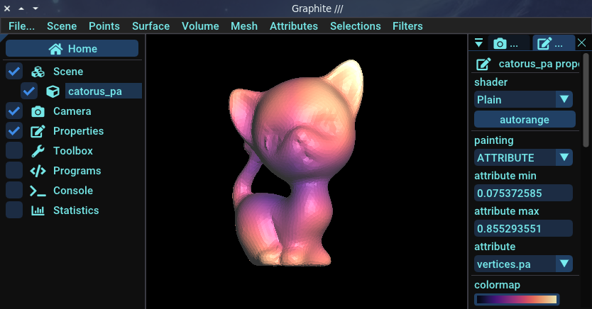
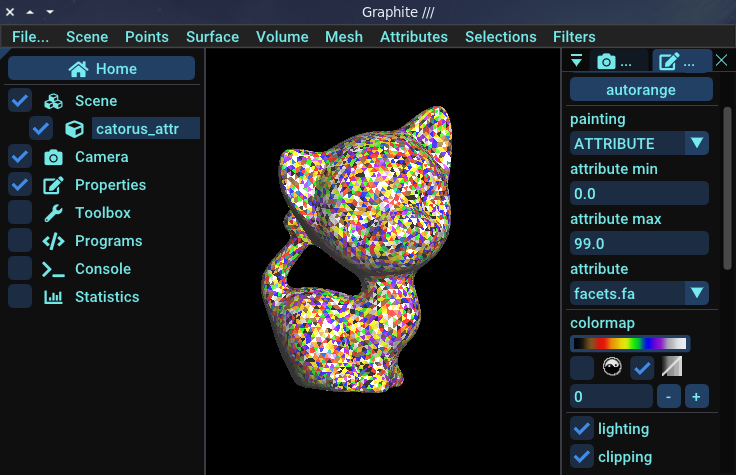

# Read / Write attributes

If you've read the section on Graphite, we talked briefly about what we call attributes. Attributes are data that can be written to the primitives of a mesh. They are detached from the mesh itself, but can still be saved when the file is saved in geogram format. 

The geogram format is specific to the Graphite viewer. The advantage of this format is that you can visualize mesh attributes in Graphite in the form of color maps. To find out more, please refer to the Graphite section.

We'll look at how to create different kinds of attributes and save them for viewing, then load them from a file.

## Attribute types

Each primitive can be associated with one or more attributes. Each primitive type has a corresponding attribute type. 

| Primitive type | Attribute type |
|---|---|
| Surface::Vertex | PointAttribute<T\> |
| Surface::Facet | FacetAttribute<T\> |
| Surface::Halfedge | CornerAttribute<T\> |
| Volume::Facet | CellFacetAttribute<T\> |
| Volume::Cell | CellAttribute<T\> |
| Polyline::Edge | EdgeAttribute<T\> |

The attributes classes are templated, so you can associate data of any type with any primitive. The most commonly used types are `double`, `int`, `bool`, `vec2`, `vec3`.

!!! warning
      - Only the geogram file format support attributes.
      - If you want to view attributes (in Graphite), only the primitive types listed above can be used.

## Create and fill attributes

### Point attribute

In this example, we'll create a point attribute for which for each vertex of the mesh we'll set the distance between origin and this vertex.

```cpp

```

Now, you just have to save attribute into the mesh file.

```cpp

```

Now, let's visualize this point attribute into Graphite. What you see is that the further away the vertices are from the origin, the whiter they are, and the closer they are, the darker they are.



### Facet attribute

In this example, we'll create a facet attribute for which we'll set a random value between 0 and 99 for each facet of the mesh.

```cpp

```

Now, you just have to save attribute into the mesh file.

```cpp

```

If you visualise this attribute into Graphite, you will see a very funky cat !




Of course, the purpose of attributes is not to make pretty and colorful cats. We can use attributes to debug and visualize what we're doing on a mesh. You'll see better examples later.

### Corner attribute

```cpp

```

If you visualise this attribute into Graphite, you will see this sort of cat:


### Edge attribute 

```cpp

```

## Save attributes

As you've seen, attributes can be saved directly in geogram files. Geogram files can then be read by graphite, which is able to display the attributes. You'll notice that attributes are stored in the file as key/value pairs: __each attribute must have a name__. 

For example we will save all previously created attributes into a geogram file:

```cpp

```

## Read attributes

Now it's time to learn how to read the attributes we've written in our geogram files:

```cpp

```

## Dynamic binding

If you want to get an attribute by name later, you can use attribute dynamic binding:

 - Declare an attribute variable
 - And bind it to a mesh attribute when necessary:
    - If the attribute exists in the mesh, your attribute variable will be filled with the attribute data
    - Otherwise, the attribute variable is filled by the default value

```cpp

```