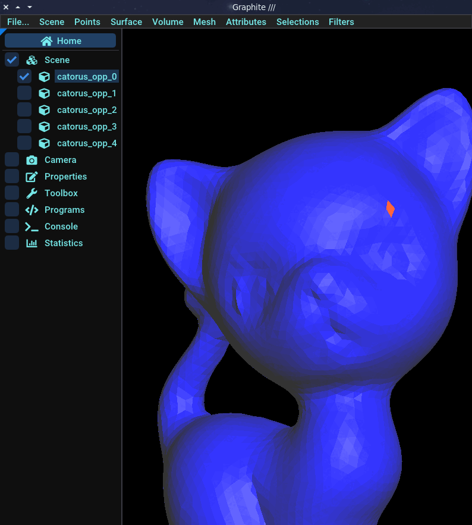
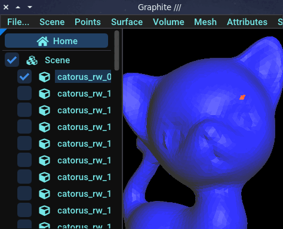

# Browse a mesh

The nicest way to traverse a mesh with ultimaille is to use iterators. These allow you to traverse mesh primitives at different levels: at the mesh level or at the primitives level.

While you can iterate over the primitives of a mesh at mesh level without any prerequisites, iterating over primitives at the level of other primitives requires something called __connectivity__.

The simplest way to traverse a mesh is to connect it. Connecting a mesh allows different primitives to know how they relate to each other.

However, a connected mesh is not easy to update or modify, and although Ultimaille takes care of updating connectivity when the mesh is modified, these operations can be slow and tedious. Furthermore, it's not always necessary to connect a mesh to work on it.

__A mesh is not connected by default__, so operations such as iterating over the vertices of a mesh face will not be accessible. Specifically, iterating on elements that require connectivity will raise an error if the mesh has not been previously connected.

In what follows, we present the two levels of iterating over mesh primitives.

### Without connectivity

#### Example 1 - Iterate primtives on mesh

For example, if you need to iterate over primitives of a mesh, you can do this directly as following:

```cpp

```

However, if you desire to do much more complicated things on theses primitives, you need to traverse the mesh at lower level.

#### Example 2 - Get primitives by id

You can also get a primitive by its id:

```cpp 

```

### With connectivity

#### Example 1 - Iterate on primitives

Just load a mesh as previously:

```cpp 

```

Connect the mesh:

```cpp 

```

Now, you can traverse mesh using the relations between primitives. For example, we want to display for all half-edges of all faces of the mesh, the positions of their vertices:

```cpp 

```

As you may have noticed, it wasn't necessary to traverse the primitives in this way, as we could have directly traversed the mesh's half-edges. However, without connectivity, we wouldn't have been able to retrieve easily the vertices of the half-edges using the `from()` and `to()` functions.

#### Example 2 - Move around

Connectivity also allows us to "move around" the mesh. For example, for a given face, we can find all its opposite faces (if it exists) by iterating over its half-edges and looking at their opposites. If you remember how half-edges work, you'll probably recall that it is possible to recover the opposite of a given half-edge. Below is an example of how to move from face to face on a surface mesh using half-edges and their opposites:

```cpp 

```

You can open the produced files into graphite by using the following command `graphite *` (open all files in the directory), and you have to get a result like this:



#### Example 3 - Random walk

Just for fun, we can adapt the last example to implement the "random walk" algorithm on the surface of a mesh:

```cpp 

```

Open files in Graphite by using the following command `graphite *`, and you should see something like that: 


