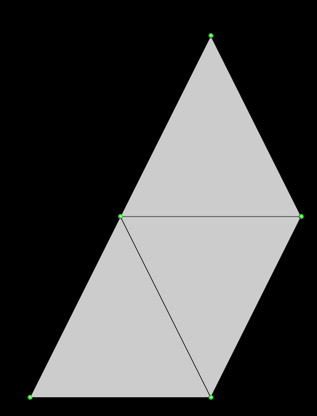
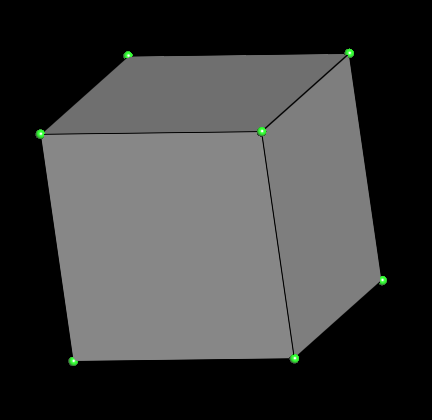

# Create a mesh

With Ultimaille, you can create many type of mesh. Surface mesh, like triangular (tri) mesh or quadrangular (quad) mesh and volume mesh like tetrahedral (tet) mesh or hexahedral (hex) mesh.

## Surface mesh

### Tri mesh

Tri mesh is a surface mesh where facets are triangles. All you have to do is create a `Triangle` and the mesh points, then facets and link each vertex facet to a point.

!!!note
      As mesh is a tri mesh, each facet has exactly 3 points. A triangle that have 2 or more vertex on the same point is degenerate.

```cpp 

```

Save the mesh as seen previously:

```cpp 

```

[Source code here](https://github.com/ultimaille/ultimaille-examples/blob/master/examples/create_tri_mesh.cpp)

With this code, you would have this simple surface mesh:



### Quad mesh

Quad mesh is a surface mesh where facets are quadrangles. All you have to do is create a `Quad` and the mesh points, then facets and link each vertex facet to a point.

!!!note
      As mesh is a quad mesh, each facet has exactly 4 points. A quadrangle that have 2 or more vertex on the same point is degenerate.

```cpp 

```



[Source code here](https://github.com/ultimaille/ultimaille-examples/blob/master/examples/edit_mesh.cpp)

## Volume mesh

### Tet mesh

[Coming soon]

### Hex mesh

[Coming soon]