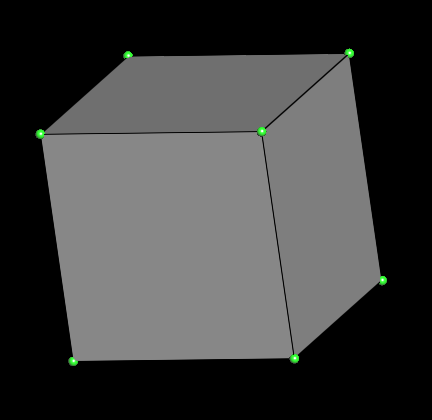
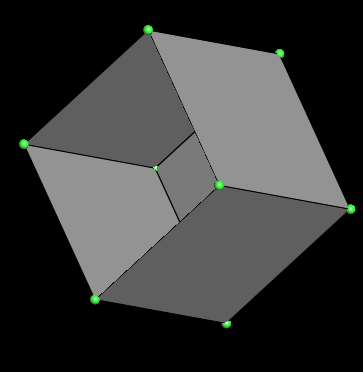
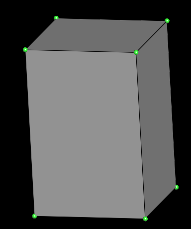

# Edit a mesh

Edit a mesh "in-place" is a little more complicated than create a mesh from scratch. First of all, you may have side-effects, although it can be helpful, it's sometimes hard to understand what we are currently doing on the mesh. But the difficulty lies mainly in adapting your code to whether you're modifying a connected or unconnected mesh. Following examples works on connected meshes. If you don't know what connectivity is, we invite you to read "[Browse a mesh](browse_mesh.md)" page.

First of all, for all following examples we'll create a cube:

!!!info
    If you want more info about creating a mesh, please refer to [Create a mesh](create_mesh.md) page.

```cpp 

```

You should obtain something which looks like a cube:



!!!warning
    As you edit a connected mesh, you must access to `conn` field. `conn` field give an access to __higher-level functions__ that lets you modify a mesh while updating connectivity automatically. If you try to update a connected mesh using low-level functions, an error is reported.

## Delete facet

In a connected mesh, the only thing to do to remove a facet is to deactivate it. When a facet is deactivated, it still exists but is no longer used. To delete it completely, simply call `compact()` on mesh. `compact` delete all deactivated facets and eventually isolated vertices.


```cpp 

```

You should obtain something like this:



## Create facet

To create a facet in a connected mesh, you just have to call `create_facet` and give an initializer list as parameter which contains the vertices ids of facet.

```cpp 

```

You should obtain the same cube as previously:


## Move a vertex

Moving a vertex is very simple, you just need to retrieve the point you wish to move and assign it a new position. Here we get 4 vertex of a cube facet and just move them on the `y` axis:

```cpp 

```

You should obtain a deformed cube, that isn't a cube anymore:


___

[Source code here](https://github.com/ultimaille/ultimaille-examples/blob/master/examples/edit_mesh.cpp)