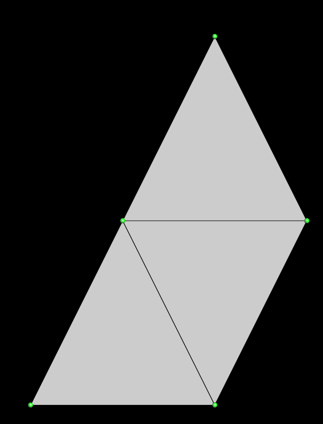
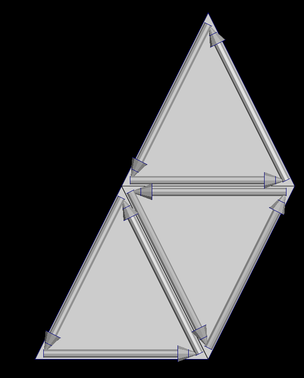

# How to ?

This section gives a quick overview of how to use ultimaille for:

 - [Load / save a mesh](load_save.md)
 - [Browse a mesh](browse_mesh.md)
 - [Create a mesh](create_mesh.md)
 - [Edit a mesh](edit_mesh.md)
 - [Read / write attributes](browse_mesh.md)

## Generalities

### What is a mesh

#### Polygonal mesh

In 3D computer graphics and solid modeling, a polygon mesh is a collection of vertices, edges and faces that defines the shape of a polyhedral object. The faces usually consist of triangles (triangle mesh), quadrilaterals (quads), or other simple convex polygons (n-gons), since this simplifies rendering, but may also be more generally composed of concave polygons, or even polygons with holes. [wiki](https://en.wikipedia.org/wiki/Polygon_mesh)

#### Volume mesh

In 3D computer graphics and modeling, volumetric meshes are a polygonal representation of the interior volume of an object. Unlike polygon meshes, which represent only the surface as polygons, volumetric meshes also discretize the interior structure of the object. [wiki](https://en.wikipedia.org/wiki/Volume_mesh)

### Meshes in Ultimaille

#### Surface mesh

Ultimaille handles surface meshes such as triangular meshes - whose faces are triangles, quadrangular meshes - whose faces are quadrilaterals - and, more generally, polygonal meshes. For each type of surface, ultimaille has the corresponding classes: `Triangle`, `Quads`, `Polygons`.

Ultimaille provides interfaces for accessing the different primitives of these meshes: vertices, faces, edges or, more precisely, half-edges and corners.

#### Volume mesh

Ultimaille also handles volume meshes: tetrahedral, hexahedral, pyramidal, wedges corresponding respectively to the classes: `Tetrahedra`, `Hexahedra`, `Pyramids`, `Wedges`.

#### Primitives

A mesh is composed of elements named primitives, different type of primitives are:

- Vertex: a 3D position
- Half-edge: an oriented edge into the face that relies two vertices
- Face: a set of half-edges
- Cell (in volumetric meshes only): a set of faces

##### Vertex

A vertex is a 3D point in space, which are generally connected by the edges of a face. Below, you can see vertices of 3 triangles in green.

##### Half-edge

A half-edge is a data structure that represents oriented edges which are contained by the faces and follow its contour. Each face have a set of half-edges and more important, each half-edge knows his previous, next and opposite half-edge. We'll see later how useful this is when we want to traverse a mesh.

### Note

You can find all the examples in this tutorial in the following repository: [ultimaille-examples](https://github.com/ultimaille/ultimaille-examples/tree/master)