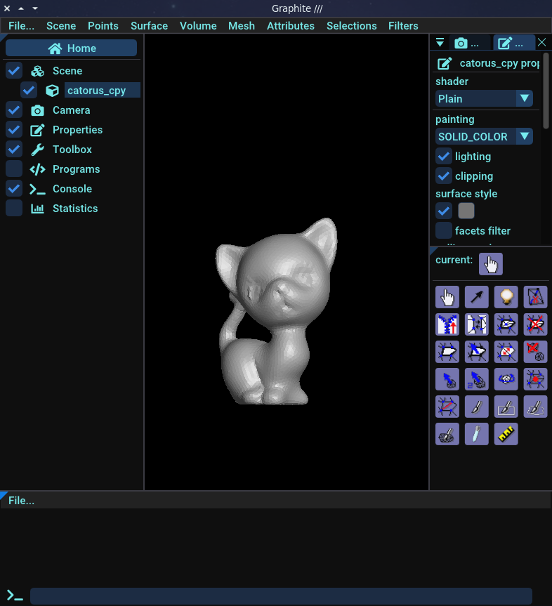

# Visualize results

## Graphite viewer

A mesh can be visualized in a number of tools, such as meshlab. For our part, we use [Graphite](https://github.com/BrunoLevy/GraphiteThree){:target="_blank"}, a lightweight yet powerful viewer that can display meshes in a variety of formats, including the geogram format.

The geogram format is interesting because it allows you to handle different types of surface or volumetric meshes and associate data with them, which we call attributes. Graphite is able to display attributes in a pleasant way.

We recommend you to download and install graphite by following the instructions on [Graphite repository](https://github.com/BrunoLevy/GraphiteThree){:target="_blank"}. On __Windows__ you can get an executable directly at [Graphite release page](https://github.com/BrunoLevy/GraphiteThree/releases){:target="_blank"}. Just get the latest graphite{version}-rc-win64.zip and unzip.

For our part, we will use graphite throughout this tutorial to visualize our results. Below an overview of Graphite:

