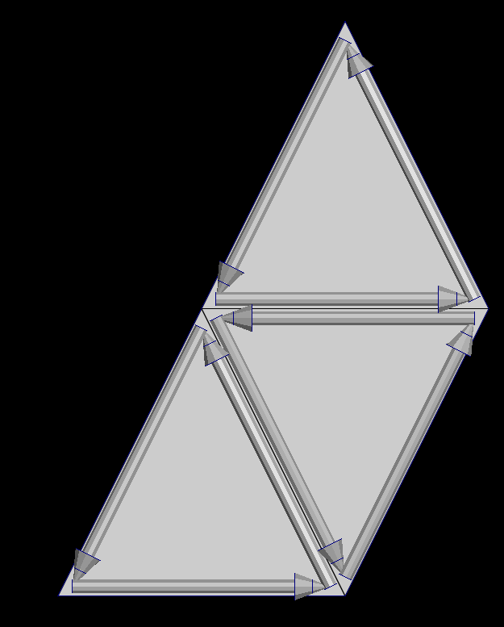
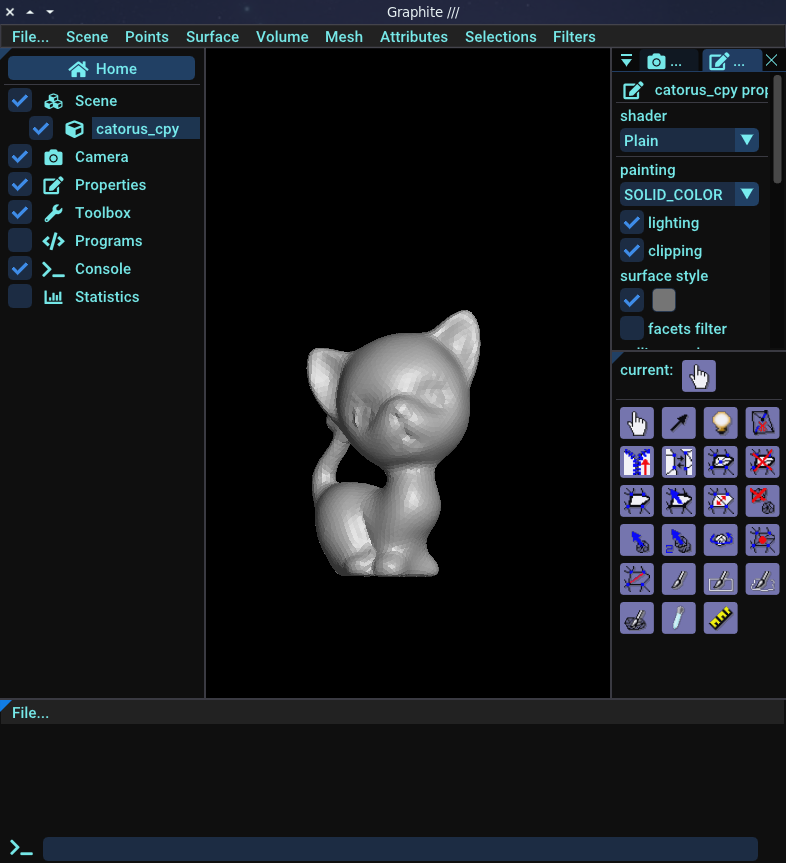
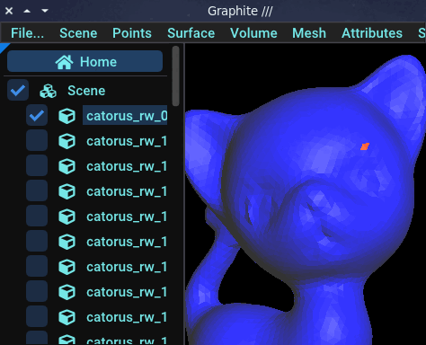

# Tutorial

## 1 - Generalities

### What is a mesh

#### Polygonal mesh

In 3D computer graphics and solid modeling, a polygon mesh is a collection of vertices, edges and faces that defines the shape of a polyhedral object. The faces usually consist of triangles (triangle mesh), quadrilaterals (quads), or other simple convex polygons (n-gons), since this simplifies rendering, but may also be more generally composed of concave polygons, or even polygons with holes. [wiki](https://en.wikipedia.org/wiki/Polygon_mesh)

#### Volume mesh

In 3D computer graphics and modeling, volumetric meshes are a polygonal representation of the interior volume of an object. Unlike polygon meshes, which represent only the surface as polygons, volumetric meshes also discretize the interior structure of the object. [wiki](https://en.wikipedia.org/wiki/Volume_mesh)

### Meshes in Ultimaille

#### Surface mesh

Ultimaille handles surface meshes such as triangular meshes - whose faces are triangles, quadrangular meshes - whose faces are quadrilaterals - and, more generally, polygonal meshes. For each type of surface, ultimaille has the corresponding classes: `Triangle`, `Quads`, `Polygons`.

Ultimaille provides interfaces for accessing the different primitives of these meshes: vertices, faces, edges or, more precisely, half-edges and corners.

#### Volume mesh

Ultimaille also handles volume meshes: tetrahedral, hexahedral, pyramidal, wedges corresponding respectively to the classes: `Tetrahedra`, `Hexahedra`, `Pyramids`, `Wedges`.

#### Primitives

A mesh is composed of elements named primitives, different type of primitives are:

- Vertex: a 3D position
- Half-edge: an oriented edge into the face that relies two vertices
- Face: a set of half-edges
- Cell (in volumetric meshes only): a set of faces

##### Vertex

A vertex is a 3D point in space, which are generally connected by the edges of a face. Below, you can see vertices of 3 triangles in green.


##### Half-edge

A half-edge is a data structure that represents oriented edges which are contained by the faces and follow its contour. Each face have a set of half-edges and more important, each half-edge knows his previous, next and opposite half-edge. We'll see later how useful this is when we want to traverse a mesh.




### Graphite viewer

A mesh can be visualized in a number of tools, such as meshlab. For our part, we use [Graphite](https://github.com/BrunoLevy/GraphiteThree), a lightweight yet powerful viewer that can display meshes in a variety of formats, including the geogram format.

The geogram format is interesting because it allows you to handle different types of surface or volumetric meshes and associate data with them, which we call attributes. Graphite is able to display attributes in a pleasant way.

We recommend you to download and install graphite by following the instructions on [Graphite repository](https://github.com/BrunoLevy/GraphiteThree).

For our part, we will use graphite throughout this tutorial to visualize our results. Below an overview of Graphite:



### Common practices

In this tutorial, in the interests of greater clarity, we declare the ultimaille namespace at the top of the cpp file. We encourage you to do the same with your own projects.

```cpp
using namespace UM;
```

Although unusual, for the sake of readability, we'll be using a python case as naming convention. For example:

```cpp
void my_function(int my_var) {
    ...
}
```

### Note

You can find all the examples in this tutorial in the following repository: [ultimaille-examples](https://github.com/ultimaille/ultimaille-examples/tree/master)

## 2 - Get started

### Open / Save a surface mesh

A mesh can be opened by using the generic function `read_by_extension` and writed using `write_by_extension`:

```cpp

```

!!!note
    If the file fails to open, the user will be notified by an error message, for example when you try to open a non-existent file:
    Failed to open /home/tex/Projects/ultimaille-examples/build/examples/assets/unavailable_catorus.geogram

!!!warning

    If the mesh type you're trying to open is not consistent with the mesh type supplied as a parameter, you won't get any errors, but only the vertices will be loaded. For example, you're trying to load a tri surface mesh into a `Quads` structure.


### Supported file types

Ultimaille currently support reading and writing into the following file formats:

 - `.geogram` (graphite)
 - `.mesh`
 - `.vtk`
 - `.xyz`
 - `.obj`

## 3 - Attributes

If you've read the section on Graphite, we talked briefly about what we call attributes. Attributes are data that can be written to the primitives of a mesh. They are detached from the mesh itself, but can still be saved when the file is saved in geogram format. 

The geogram format is specific to the Graphite viewer. The advantage of this format is that you can visualize mesh attributes in Graphite in the form of color maps. To find out more, please refer to the Graphite section.

We'll look at how to create different kinds of attributes and save them for viewing, then load them from a file.

### Attribute types

Each primitive can be associated with one or more attributes. Each primitive type has a corresponding attribute type. 

| Primitive type | Attribute type |
|---|---|
| Surface::Vertex | PointAttribute<T\> |
| Surface::Facet | FacetAttribute<T\> |
| Surface::Edge | CornerAttribute<T\> |

The attributes classes are templated, so you can associate data of any type with any primitive. The most commonly used types are `double`, `int`, `bool`, `vec2`, `vec3`.

!!! warning
      - Only the geogram file format support attributes.
      - If you want to view attributes (in Graphite), only the primitive types listed above can be used.

### Create and fill attributes

#### Example 1 - Point attribute

In this example, we'll create a point attribute for which for each vertex of the mesh we'll set the distance between origin and this vertex.

```cpp

```

Now, you just have to save attribute into the mesh file.

```cpp

```

Now, let's visualize this point attribute into Graphite. What you see is that the further away the vertices are from the origin, the whiter they are, and the closer they are, the darker they are.


#### Example 2 - Facet attribute

In this example, we'll create a facet attribute for which we'll set a random value between 0 and 99 for each facet of the mesh.

```cpp

```

Now, you just have to save attribute into the mesh file.

```cpp

```

If you visualise this attribute into Graphite, you will see a very funky cat !


Of course, the purpose of attributes is not to make pretty and colorful cats. We can use attributes to debug and visualize what we're doing on a mesh. You'll see better examples later.

#### Example 3 - Corner attribute

[Coming soon]

## 4 - Traverse a mesh

The nicest way to traverse a mesh with ultimaille is to use iterators. These allow you to traverse mesh primitives at different levels: at the mesh level or at the primitives level.

While you can iterate over the primitives of a mesh at mesh level without any prerequisites, iterating over primitives at the level of other primitives requires something called __connectivity__.

The simplest way to traverse a mesh is to connect it. Connecting a mesh allows different primitives to know how they relate to each other.

However, a connected mesh is not easy to update or modify, and although Ultimaille takes care of updating connectivity when the mesh is modified, these operations can be slow and tedious. Furthermore, it's not always necessary to connect a mesh to work on it.

__A mesh is not connected by default__, so operations such as iterating over the vertices of a mesh face will not be accessible. Specifically, iterating on elements that require connectivity will raise an error if the mesh has not been previously connected.

In what follows, we present the two levels of iterating over mesh primitives.

### Without connectivity

For example, if you need to iterate over primitives of a mesh, you can do this directly as following:

```cpp

```

However, if you desire to do much more complicated things on theses primitives, you need to traverse the mesh at lower level.

### With connectivity

#### Example 1 - Just iterate

Just load a mesh as previously:

```cpp 

```

Connect the mesh:

```cpp 

```

Now, you can traverse mesh using the relations between primitives. For example, we want to display for all half-edges of all faces of the mesh, the positions of their vertices:

```cpp 

```

As you may have noticed, it wasn't necessary to traverse the primitives in this way, as we could have directly traversed the mesh's half-edges. However, without connectivity, we wouldn't have been able to retrieve easily the vertices of the half-edges using the `from()` and `to()` functions.

#### Example 2 - Move around

Connectivity also allows us to "move around" the mesh. For example, for a given face, we can find all its opposite faces (if it exists) by iterating over its half-edges and looking at their opposites. If you remember how half-edges work, you'll probably recall that it is possible to recover the opposite of a given half-edge. Below is an example of how to move from face to face on a surface mesh using half-edges and their opposites:

```cpp 

```

You can open the produced files into graphite by using the following command `graphite *` (open all files in the directory), and you have to get a result like this:


#### Example 3 - Random walk

Just for fun, we can adapt the last example to implement the "random walk" algorithm on the surface of a mesh:

```cpp 

```

Open files in Graphite by using the following command `graphite *`, and you should see something like that: 



## 5 - Create a mesh

### Tri mesh


```cpp 

```

Save the mesh as seen previously:

```cpp 

```

With this code, you would have this simple surface mesh:


### Quad mesh

[Coming soon]

### Tet mesh

[Coming soon]

### Hex mesh

[Coming soon]

## 6 - Edit a mesh

Edit a mesh "in-place" is a little more complicated than create a mesh from scratch. First of all, you may have side-effects, although it can be helpful, it's sometimes hard to understand what we are currently doing on the mesh. But the difficulty lies mainly in adapting your code to whether you're modifying a connected or unconnected mesh.

[Coming soon]

## 7 - Further, funny examples

[Coming soon]